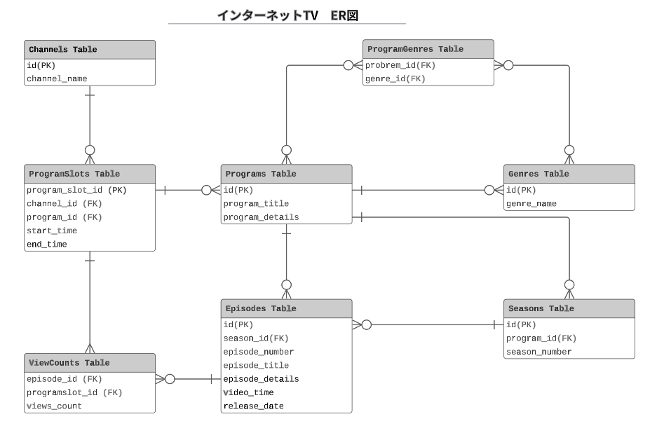
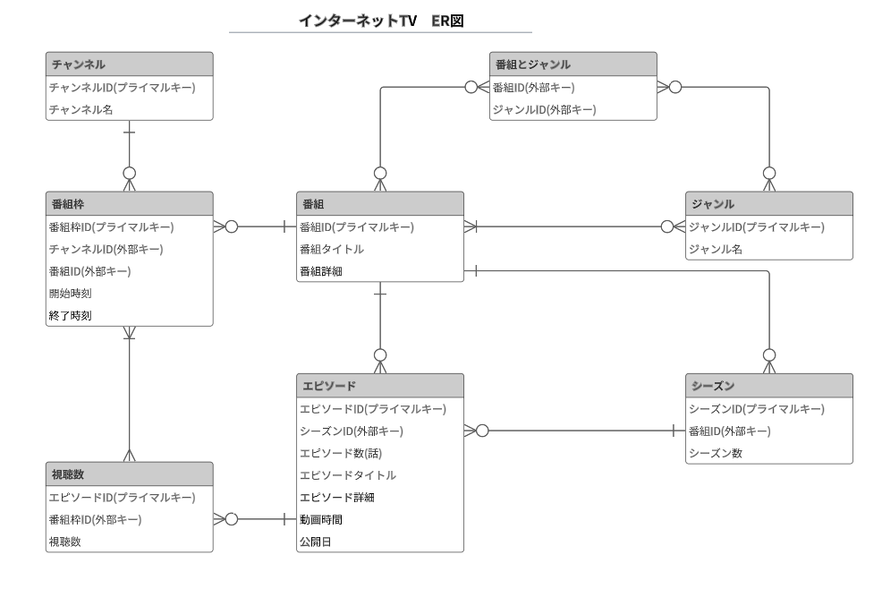

# インターネットTV テーブル設計

### Channel Table					
| カラム名     | データ型     | NULL | キー    | 初期値 | AUTO INCREMENT | 
| ------------ | ------------ | ---- | ------- | ------ | -------------- | 
| id           | bigint       | NO   | PRIMARY |        | YES            | 
| channel_name | varchar(100) | NO   |         |        |                | 

### Program Table
| カラム名        | データ型     | NULL | キー    | 初期値 | AUTO INCREMENT | 
| --------------- | ------------ | ---- | ------- | ------ | -------------- | 
| id              | bigint       | NO   | PRIMARY |        | YES            | 
| program_title   | varchar(100) | NO   |         |        |                | 
| program_details | varchar(200) | NO   |         |        |                | 

### Season Table
| カラム名      | データ型 | NULL | キー                                      | 初期値 | AUTO INCREMENT | 
| ------------- | -------- | ---- | ----------------------------------------- | ------ | -------------- | 
| id            | bigint   | NO   | PRIMARY                                   |        | YES            | 
| program_id    | bigint   | NO   | FOREIGN    REFERENCES Program(program_id) |        |                | 
| season_number | integer  | NO   |                                           |        |                | 

### Episode Table

| カラム名        | データ型     | NULL | キー                                  | 初期値 | AUTO INCREMENT | 
| --------------- | ------------ | ---- | ------------------------------------- | ------ | -------------- | 
| id              | bigint       | NO   | PRIMARY                               |        | YES            | 
| season_id       | bigint       | NO   | FOREIGN REFERENCES Season(season_id) |        |                | 
| episode_number  | integer      |      |                                       |        |                | 
| episode_title   | varchar(100) | NO   |                                       |        |                | 
| episode_details | varchar(200) | NO   |                                       |        |                | 
| duration        | time         | NO   |                                       |        |                | 
| release_date    | date         | NO   |                                       |        |                | 

###  Genre Table
| カラム名   | データ型     | NULL | キー | 初期値 | AUTO INCREMENT | 
| ---------- | ------------ | ---- | ---- | ------ | -------------- | 
| id         | bigint       | NO   |      |        | YES            | 
| genre_name | varchar(100) | NO   |      |        |                | 

### ProgramSlot Table
| カラム名   | データ型 | NULL | キー                                    | 初期値 | AUTO INCREMENT | 
| ---------- | -------- | ---- | --------------------------------------- | ------ | -------------- | 
| id         | bigint   | NO   | PRIMARY                                 |        | YES            | 
| channel_id | bigint   | NO   | FOREIGN REFERENCES Channel(channel_id) |        |                | 
| program_id | bigint   | NO   | FOREIGN REFERENCES Program(program_id) |        |                | 
| start_time | datetime | NO   |                                         |        |                | 
| end_time   | datetime | NO   |                                         |        |                | 

### ViewCount Table
| カラム名       | データ型 | NULL | キー                                             | 初期値 | AUTO INCREMENT | 
| -------------- | -------- | ---- | ------------------------------------------------ | ------ | -------------- | 
| id             | bigint   | NO   | FOREIGN　REFERENCES Episode(episode_id)          |        | YES            | 
| programslot_id | bigint   | NO   | FOREIGN　REFERENCES ProgramSlot(program_slot_id) |        |                | 
| view_count     | integer  | NO   |                                                  |        |                | 

### ProgramGenre Table
| カラム名 | データ型 | NULL | キー                                            | 初期値 | AUTO INCREMENT | 
| -------- | -------- | ---- | ----------------------------------------------- | ------ | -------------- | 
| id       | bigint   | NO   | FOREIGN REFERENCES Program(program_id)         |        |                | 
| genre_id | bigint   | NO   | FOREIGN FOREIGN KEY REFERENCES Genre(genre_id) |        |                | 

# ER図

